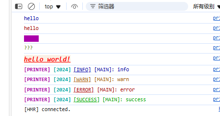

设置 npm 源

`npm config set registry https://registry.npmjs.org`

安装

`npm install @suey/printer --save`




```javascript
import { print, printInfo, printWarn, printError } from '@suey/printer';

`调用这个函数你可以格式化打印你想要的信息, 相比于 console.log, 此函数的调用更加符合函数化, 人性化
请注意, 由于控制台所处于的平台不同, 可能出现打印失效的情况
例如：CSS 样式, 可能在 Windows 控制台中可能就会出现不支持的情况
目前 ANSI 模式表现良好`

print('HelloWorld'); // 无格式化信息

print(toColor('red', 'HelloWorld'), '你的打印信息的位置可以自己选择'); // 使用toColor配合,红色字体信息

print(toColor('red'), 'HelloWrold'); // 使用toColor配合,红色字体信息

print(toColor(['white', 'red:bg']), 'HelloWorld'); // 使用toColor创建多ANSI格式的样式

print(toColor({ color: 'red' }), 'HelloWrold'); // 使用toColor创建css格式的样式, 用这个方式相较于直接书写css更加友好,具有ts类型提示

printInfo('HelloWrold!');

printWarn('Warn'); // 打印一条警告信息, 黄色字体

printError('error'); // 打印一条错误信息, 红色字体

```

```javascript
import {Printer} from '@suey/printer';
// 通过 Printer 类获得你想要的日志打印格式

Printer.print('hello');

Printer.printInfo('hello');

Printer.printWarn('hello');

Printer.printError('hello');

// 在此中你可以设置打印的内容, 打印的格式
// init 会改变所有 Printer 静态方法上的打印格式. 如果你需要创建一个特殊额, 请使用 new 关键字为其生成一个对象
Printer.init({}, {});

type
PrintOptions = Partial < {
    autoPrintName: boolean; // 是否自动打印 NAME
    printName: string; // NAME 值

    autoPrintTime: boolean; // 是否自动打印时间
    printTime: () => string; // 时间的获取函数

    autoPrintType: boolean; // 是否自动打印类型, 例如 INFO, WARN
    printType: string; // 打印类型, 其中固定方法不能被覆盖

    autoPrintThead: boolean; // 是否自动打印所在线程, 默认为 MAIN 主线程, 你可以自定义
    printThead: string; // 线程名字
} >;

type
ColorInfo = Partial < { // 对应上述类型, 要求返回一个格式化样式信息, 使用 toColor 函数创造样式信息
    printName: __SYMBOL_ARRAY__ < [string, ...(unknown[])] >;
    printTIme: __SYMBOL_ARRAY__ < [string, ...(unknown[])] >;
    printType: __SYMBOL_ARRAY__ < [string, ...(unknown[])] >;
    printThead: __SYMBOL_ARRAY__ < [string, ...(unknown[])] >;
} >;
```

